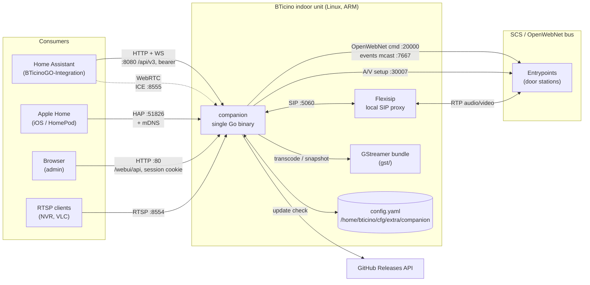
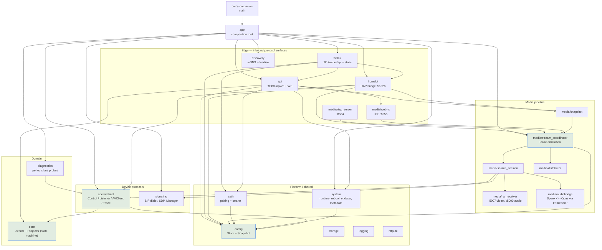
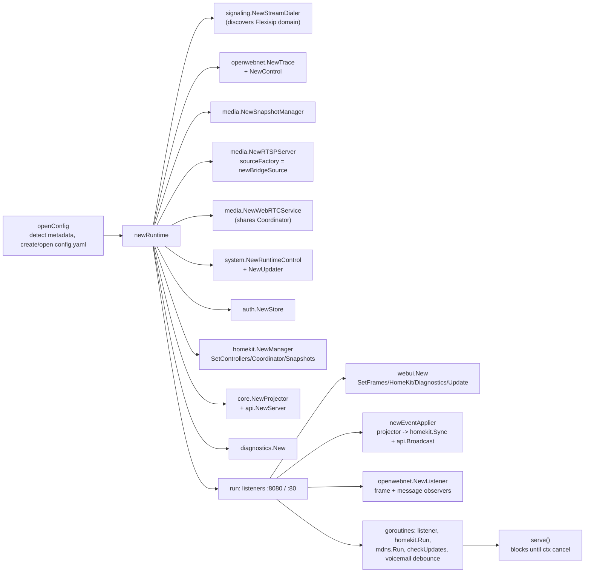
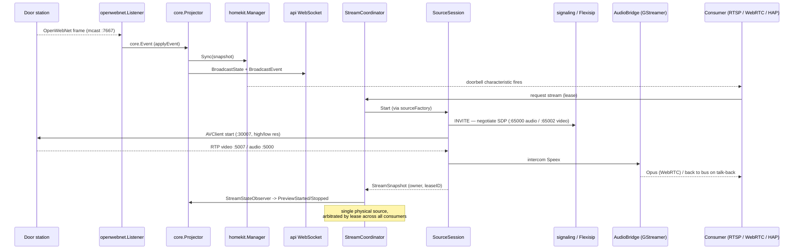

# BTicino GO Companion — Architecture

A single Go binary (`cmd/companion`) that runs **on** a BTicino indoor unit (Classe 300X / 100X)
and exposes the intercom to modern smart-home ecosystems. It speaks the device's native
OpenWebNet + SIP protocols on one side, and HTTP/WebSocket, RTSP/WebRTC and HomeKit
Accessory Protocol on the other.

Generated from the codebase knowledge graph (2068 nodes / 8830 edges) plus
[internal/app/run.go](../internal/app/run.go), which is the single wiring point.

---

## 1. System context

**Key idea:** the companion does not replace the intercom stack — it *joins* it. It places a SIP
call through the device's own Flexisip proxy to pull the door-station A/V stream, and drives
door locks / audio / voicemail over OpenWebNet.

---

## 2. Package structure

Layers are derived from actual call direction (`boundaries` + `layers` in the graph).
Everything below `internal/`; module path `bticino-go-companion`.

### Structural hotspots (highest fan-in)

| Symbol | Fan-in | Role |
|---|---|---|
| `openwebnet.Client.Unlock` | 93 | door-lock command path — every consumer converges here |
| `webui.server.New` | 79 | admin server constructor |
| `config.Default` | 29 | config baseline, used everywhere incl. tests |
| `homekit.lifecycle.ConfigStore.Snapshot` | 26 | copy-on-read config access |
| `api.writeError` / `writeOK` / `webui.writeJSON` | 20–22 | HTTP response helpers |

`config` (52 inbound, 0 outbound), `core`, `openwebnet` and `api` are true sink layers —
they never call back up into edge packages. That's the invariant to preserve.

---

## 3. Composition root

`app.newRuntime` builds every collaborator once and wires them by interface; `app.run` then
starts the goroutines. Construction order matters — it encodes the dependency DAG.

The single most important line is `newEventApplier`
([run.go:405](../internal/app/run.go#L405)): **all** state change funnels through
`Projector.Apply`, then fans out to HomeKit characteristics and the API WebSocket. There is one
source of truth for state, and one place it is published from.

---

## 4. Runtime flow — a doorbell ring becomes a video stream

`StreamCoordinator` exists because the hardware allows **one** A/V session at a time. RTSP
clients, the WebRTC preview, HomeKit camera streams and snapshot capture all contend for the
same lease; the coordinator serialises them and reports ownership back into the projector.

---

## 5. Inbound surfaces

| Surface | Bind | Auth | Consumer |
|---|---|---|---|
| Companion API v3 | `:8080` `/api/v3/*` | bearer token, pairing flow (`auth.Store`) | Home Assistant integration |
| Admin Web UI | `:80` `/webui/api/*` + static `/` | username + password hash, session cookie | browser |
| HomeKit (HAP) | `:51826` | HomeKit PIN + SetupID, `hap.FsStore` | Apple Home |
| RTSP | `:8554` | — (LAN) | NVR / players |
| WebRTC | ICE `:8555` | via API bearer (`/api/v3/webrtc/ws`) | HA live preview |
| mDNS | multicast | — | HA discovery (device ID, model, pairing state, instance ID) |

### `/api/v3` — [internal/api/api.go:76-102](../internal/api/api.go#L76-L102)

Unauthenticated: `GET health`, `GET auth/status`, `POST pair/challenge`, `POST pair/claim`,
`POST auth/recover`. Everything else goes through `handleProtected` (bearer):

| Group | Endpoints |
|---|---|
| Auth | `POST auth/rotate`, `POST auth/revoke` |
| State | `GET state`, `GET diagnostics` |
| System | `GET system/update/status`, `POST system/update/{check,stage,install}`, `POST system/reboot`, `POST system/services/{name}/restart` |
| Control | `POST entrypoints/{id}/unlock`, `POST audio/{mute,unmute}`, `POST voicemail/{enable,disable,refresh}` |
| Streams | `GET ws`, `GET webrtc/ws`, `GET entrypoints/{id}/snapshot/latest.jpg` |

Unmatched `/api/v3/` paths hit an explicit `notFound` rather than falling through to static.

### `/webui/api` — [internal/webui/server.go:136-161](../internal/webui/server.go#L136-L161)

`session`, `login`, `admin/{logout,account,restart,reboot}`, `bootstrap/account`,
`config/homeassistant{,/recovery-code}`, `config/entrypoints` (GET/PUT),
`config/homekit{,/qr,/reset}` (GET/PUT/POST), `management/system` (GET/PUT),
`management/diagnostics`, `management/update{,/check}`,
`logs/companion{,/level}`, `logs/openwebnet`. All but `session`/`login`/`bootstrap/account`
are wrapped in `requireReady`.

> **Note:** `get_architecture`'s `routes` aspect reports these as `/api/v2/*` paths that exist
> nowhere in the tree — its route extractor is unreliable for this project. Read the mux
> registrations directly.

---

## 6. Notable design decisions

- **Copy-on-read config.** `config.Store.Snapshot()` returns a value copy; nothing holds a
  pointer into live config. Mutation goes through `Update(func(*Config) error)`.
- **Event sourcing at the edge, projection in the middle.** OpenWebNet frames are parsed into
  `core.Event` values; `Projector` is the only state machine and rejects invalid transitions
  (`ErrInvalidTransition`) rather than silently accepting them.
- **Interface-injected collaborators.** `api.Server` receives capabilities via `SetEntrypoints`,
  `SetAudio`, `SetVoicemail`, `SetWebRTC`, `SetSnapshot`, `SetRuntime`, `SetUpdate` — which is
  why `internal/api/interfaces.go` exists and why the package tests need no device.
- **Self-update in-process.** `system.Updater` polls GitHub releases (20s, then 3h; exponential
  backoff to 1h on failure), stages the artifact and restarts the `companion` service through
  `RuntimeControl`.
- **Debounced voicemail refresh.** An `aswm` ACK frame schedules a single refresh 250ms later
  with drain-on-wake, avoiding a burst of bus queries.
- **Tests colocated and heavy.** 37 of 90 Go files are `_test.go` (588 `TESTS` edges in the
  graph); almost every package ships hand-written fakes rather than a mocking framework.

---

## 7. Related repositories

- **BTicinoGO-Integration** — the Home Assistant custom integration consuming `/api/v2`
  (branch `dev/card` holds the modernized card).
- **c300x-controller** — earlier controller for the same hardware.
